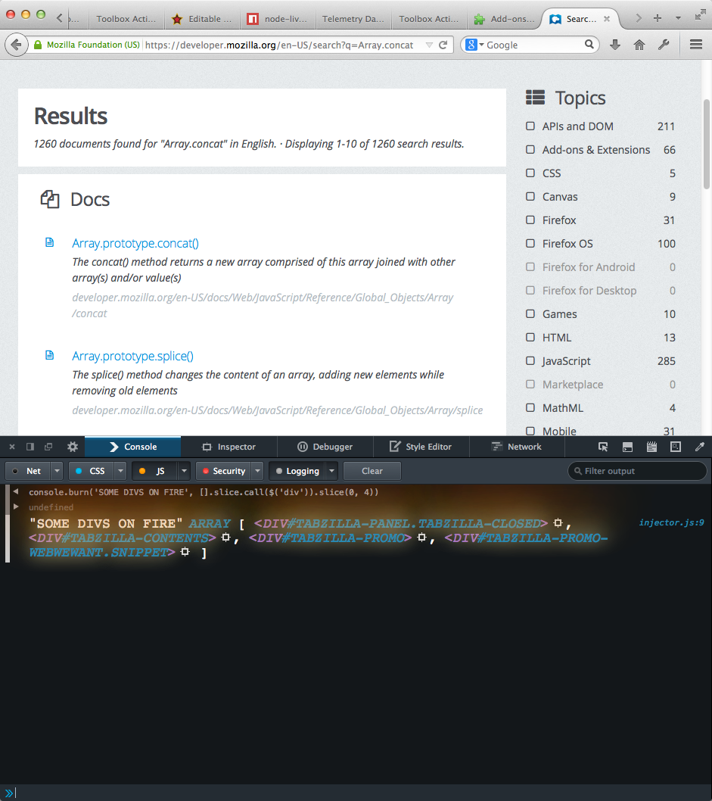

# Burner

*Implements console.burn.*

Example: 

Polyfill ( for non-Firefox browsersthat support %c ):

    function _burn(text) {
      var fireStyle = 'text-align: center;margin: 5px auto;font-family: Courier;font-size: 18px; text-transform: uppercase;color: #fff;text-shadow: 0 0 20px #fefcc9, 10px -10px 30px #feec85, -20px -20px 40px #ffae34, 20px -40px 50px #ec760c, -20px -60px 60px #cd4606, 0 -80px 70px #973716, 10px -90px 80px #451b0e;}';
      var newArgs = ["%c"+text, fireStyle];

      var args = [].slice.call(arguments);
      if (args.length > 1) {
        console.log("got here...");
        newArgs = newArgs.concat(args.slice(1));
      }
      console.log(newArgs);
      console.log.apply(this, newArgs);
    }
    if (console.burn === void 0){
        console.burn = _burn;
    }

